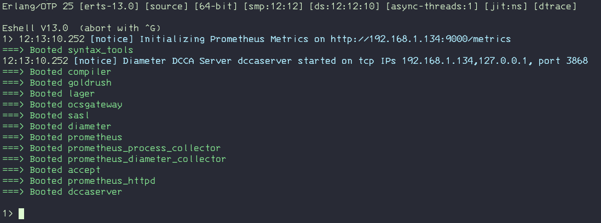

# Erlang Diameter Credit Control Server Application

This repository contains an example OTP DCCA application server built in Erlang.

To run the commands, you need [rebar3](https://rebar3.org/docs/getting-started/) that can be either installed into the system (for example using Brew on Mac) or downloaded into the current application diretory (with execution permission).

To build the modules and diameter dictionaries, use rebar:

    rebar3 compile

To start the module in a shell use:

    rebar3 shell

Or use the provided Makefile:

    make shell



To **exit**, type `Ctrl+G` to call the Erlang shell followed by the command "q".

The server also contains a flamegraph style tracer that can be called using `dccaserver:trace().` from the console (Erlang shell) that will collect data for 10 seconds. There is also a `dccaserver:trace(Integer).` function that accepts the amount of collection time in seconds.


The tracer will generate a `.out` file that can be converted to an SVG file with `cat flame-xxxxx.trace.out|grep -v lager | ./_build/default/lib/eflame/flamegraph.riak-color.pl > flame.svg` (for example filtering-out lager calls) or opened on a flamegraph viewer website like <https://www.speedscope.app/>.

A release is also available and built with the commands below. To load the application use:

    rebar3 release
    ./_build/default/rel/dccaserver/bin/dccaserver console

To create a release and a tar.gz archive for production with erts included:

    rebar3 as prod release

    ./_build/prod/rel/dccaserver/bin/dccaserver console
    rebar3 as prod tar

## Monitoring and Running on Docker

The server exposes Prometheus metrics for the BEAM VM and the application at <http://localhost:9000/metrics>. There are some  Grafana dashboards included that were sourced from <https://github.com/deadtrickster/beam-dashboards>.


Sample metrics:

```txt
# TYPE diameter_applications gauge
# HELP diameter_applications Number of installed DIAMETER applications.
diameter_applications{svc="dccaserver"} 1
# TYPE diameter_connections gauge
# HELP diameter_connections Number of connections to peers.
diameter_connections{svc="dccaserver",peer="example.com",type="responder",state="okay",protocol="tcp"} 1
# TYPE diameter_messages gauge
# HELP diameter_messages Number of requests.
diameter_messages{svc="dccaserver",peer="example.com",direction="recv",type="answer",msg="DWA",rc="2001"} 6
diameter_messages{svc="dccaserver",peer="example.com",direction="recv",type="request",msg="CCR"} 6
diameter_messages{svc="dccaserver",peer="example.com",direction="recv",type="request",msg="CER"} 1
diameter_messages{svc="dccaserver",peer="example.com",direction="recv",type="request",msg="DWR"} 3
diameter_messages{svc="dccaserver",peer="example.com",direction="send",type="answer",msg="CCA",rc="2001"} 6
diameter_messages{svc="dccaserver",peer="example.com",direction="send",type="answer",msg="CEA",rc="2001"} 1
diameter_messages{svc="dccaserver",peer="example.com",direction="send",type="answer",msg="DWA",rc="2001"} 3
diameter_messages{svc="dccaserver",peer="example.com",direction="send",type="request",msg="DWR"} 6
# TYPE diameter_errors gauge
# HELP diameter_errors Number of errors.
```

You can run the complete application stack with the DCCA server, Prometheus and Grafana on Docker containers with:

```sh
make stack
```

Prometheus will be accessible at <http://localhost:9090/metrics> and Grafana at <http://localhost:3000>. Login with "admin/admin" and load the dashboards from "Erlang/DCCA" folder.

## Testing

To test the server, use the client module from project [dcca-client-OTP](https://github.com/carlosedp/dcca-client-OTP) or Seagull with included files.

### Client (dcca-client-OTP)

If using the client sample application, clone the repository linked above and inside it run:

    git clone https://github.com/carlosedp/dcca-client-OTP
    cd dcca-client-OTP
    make shell
    dccaclient:test().

### Seagull

Seagull can be used to generate Diameter traffic to the server. The configuration, scenario xml and start scripts are in `test/seagull` dir.

Test can be run with `make seagull` that will use Docker with the application and the test configs provided here. Before running, adjust the server IP in the `conf_GPRS.xml` file.

Also the application can be installed from [http://gull.sourceforge.net/doc/](http://gull.sourceforge.net/doc/).


